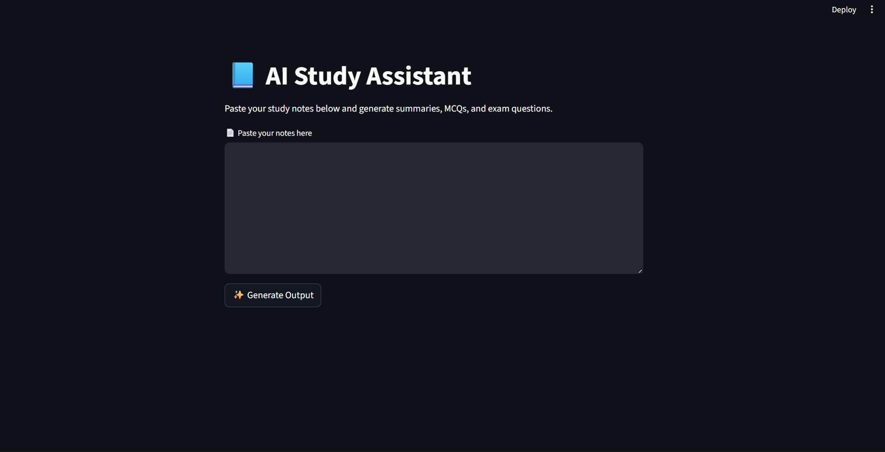
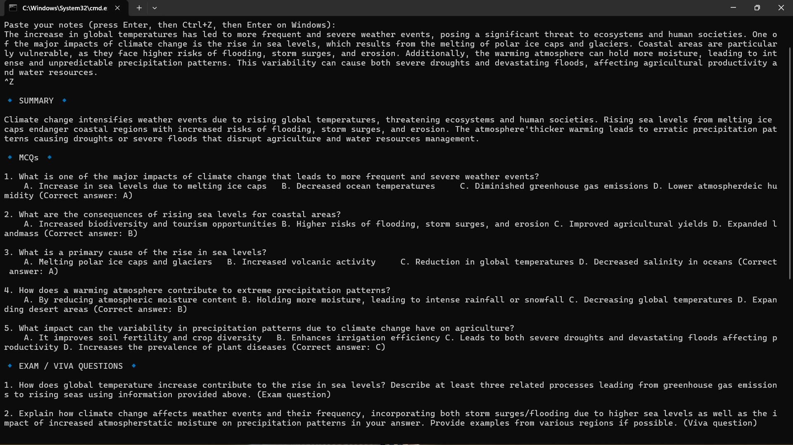
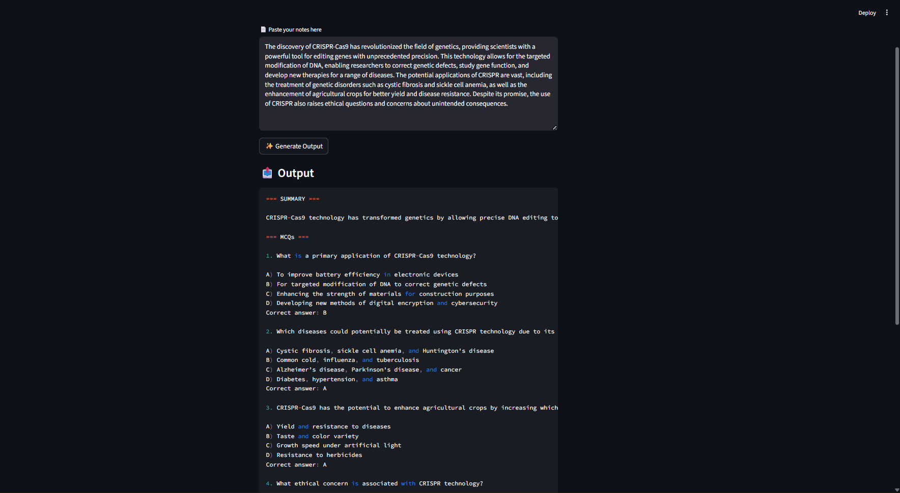

# AI Study Assistant

## Overview
AI Study Assistant is a Python-based application designed to help students study more effectively.
It allows users to paste their study notes and automatically generates:
- A concise summary
- Multiple Choice Questions (MCQs)
- Exam and viva-oriented questions

This project focuses on improving learning efficiency using AI-assisted text processing.

---

## Features
- Summarizes long study notes into easy-to-understand points
- Generates exam-oriented MCQs with answers
- Creates important exam and viva questions
- Simple and clean user interface

## Tech Stack
- Python
- Streamlit
- Natural Language Processing (NLP)
- Large Language Models (LLMs)

---

## How It Works
1. User pastes study notes into the application
2. The text is processed using AI-based language models
3. The application generates:
   - Summary
   - MCQs
   - Exam/Viva questions

---

## Project Status
- Currently runs locally
- Online deployment planned

---

## Screenshots

### 🖥️ User Interface

### 📊 Generated Output

---

## Author
**Swapnil Tiwari**  
B.Sc. IT (Hons.), Parul University
